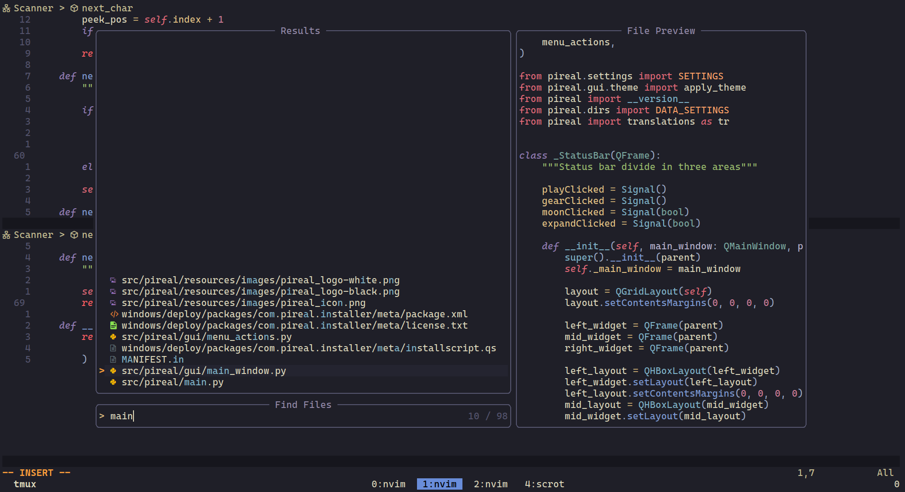
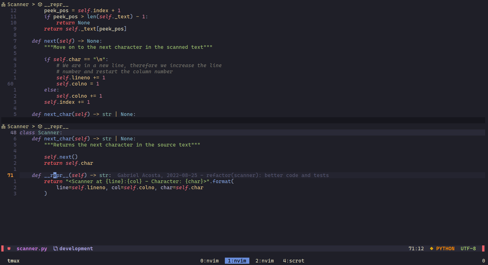
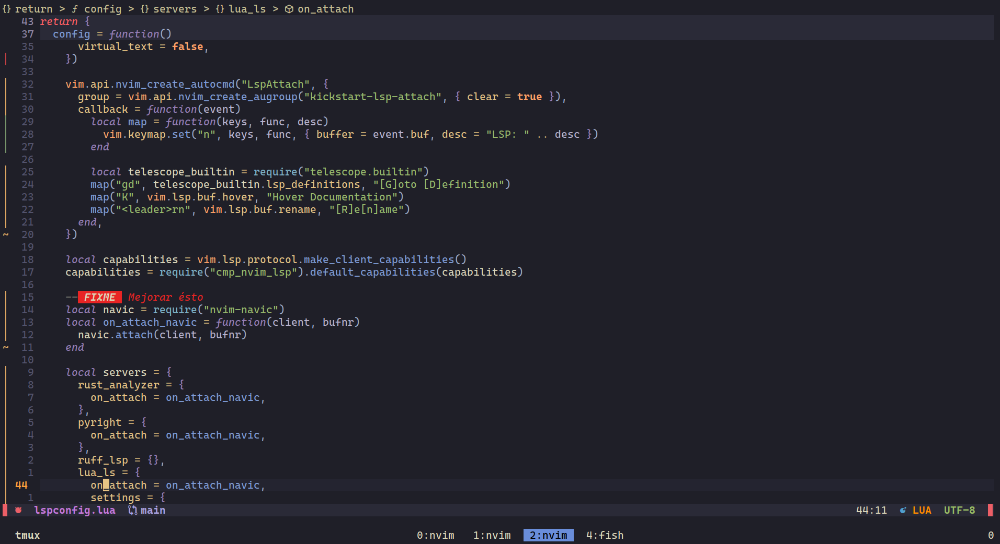

# nvim
Hi! This is my custom NeoVim configuration for my daily workflow :).

## Screenshots

## TODO
- [] Disable signature help when open brance
- [] Save state (last cursor position) after exit
